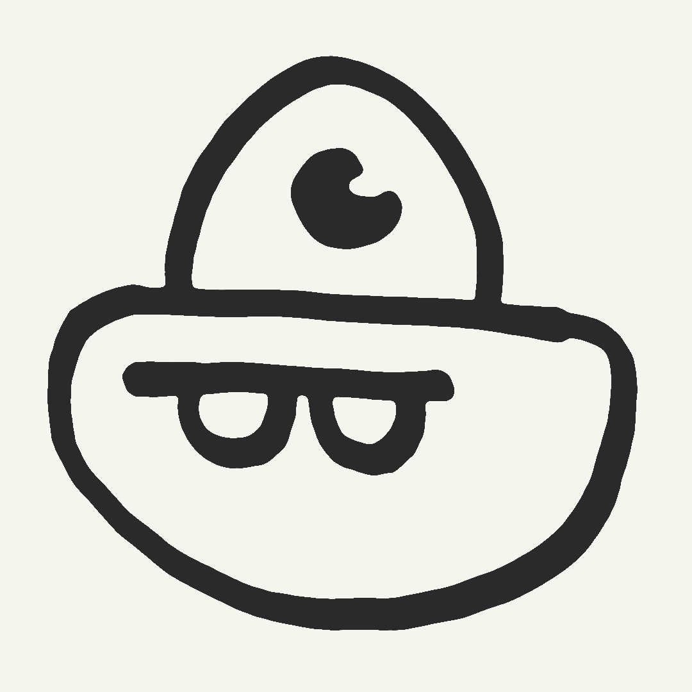

# Topolang

## Motivation

Topolang is an esoteric topology-based programming language. The problem this
language sets out to solve is very specific:

*How could you write code that could be read from any orientation, both
forwards and backwards, and that doesn't use any special symbols?*

This constraint enforces that programs are structured as a set of contiguous
unordered blocks. The nesting of these blocks is where the structure of the
programming language is derived from. Because of this, we can rethink our
language as being a completely set based language, since each block can contain
any N number of contiguous blocks within it. For example `{{}, {}}` is the set
representation of the "topology" of the symbol 8, since 8 is one contiguous
block that contains 2 contiguous blocks within it.

## Sets to Tokens

To take us one step closer to something that can actually be evaluated it would
be useful to be able to have items in our sets. Perhaps if we were able to get
something like `{1, 2, +}`, we could start thinking about what evaluation might
look like, but until then it's very difficult to reason about how we could
derive anything useful from an unordered tree.

The method I came up with to get around this is to 'tokenize' sets by mapping a
single sided chain of nested sets to a walk on a D-ary huffman encoding tree.
This sounds like nonsense so let me try to explain:

From the deepest point of any set we can attempt to perform a walk back up the
set and count the number of sets at each later. That number of sets is the
'signature' of our set, so for example:
-  `{{}}` has a signature of 1, as there is 1 set within the set
- `{{}, {}}` has a signature of 2, as there are 2 sets
- `{{{}, {}}}` has a signature of [2, 1] as there are 2 sets, enclosed by
another set

Obviously this doesn't work for sets of equal nesting such as `{{{}}, {{},
{}}}` (do we consider this [1, 2] or [2, 2]?) so these are invalid tokens.
Each number of these signatures represents the number of a choice to be
made when walking down a D-ary huffman encoding tree. For the specifics of
topolang [1] maps to λ and [2, n] maps to natural number n ([3] also will
map to operators at some point but I haven't implemented this yet).
This allows us to construct sets that look like this: ``` {λ, 1} ``` from
sets that look like this: ``` {{{}}, {{{}, {}}}} ```

## Sets as programs??

How on earth do we 'evaluate' sets of sets as programs though? This is
difficult since almost every programming language depends on ordering. A
program `x = 3; x = 4; return x` is very different from a program `x = 4; x
= 3; return x` which is also very different from `return x; x = 4; x = 3`,
so how do we get around this? While there may be some clever ideas of
parallel execution and multiple program states I am not smart enough to
implement those (trust me I tried) so I have sidestepped them by using
nesting and implementing a lambda calculus adjacent core.

One might anticipate identifiers and variables to be a difficult
implementation challenge however we can also sidestep this problem by
implementing [DeBruijn
indices](https://en.wikipedia.org/wiki/De_Bruijn_index) for our variables.
As such a program of `\x.x` becomes `\1`.

For topolang every set containing λ and another term represents an
abstraction / lambda definition. To distinguish the ordering of
applications, it is important the function is more deeply nested than the
term. For example: `{{f}, x}`

## Implementation

The heart of this project is written in C++ because I like C++ and wanted
an excuse to use it. Included is a web interface to test out the language
with.. in the future I want to implement a way to use images as input and
extract their contiguous regions but that is a bit far out as the GUI is
very minimal as is.

## Ivan

Ivan is the mascot of Topolang; he is designed such that his topology mirrors
the implementation of the identity function. He also highlights that since
programs are based only on contiguous blocks, you are given almost infinite
creative freedom in how you want them to look.


